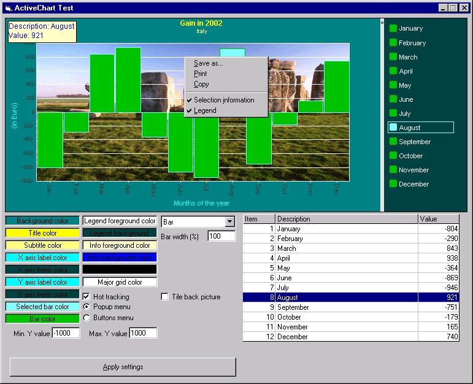

## ActiveChart \(evolution\)

### Description

I found on PSC the ActiveChart control and decided to use it in my programs, but it was not fully customizable. So, I implemented some new features.

I'm still working on it for other customizations.

Thanks for your interest in my work and thank you to MIRAGE for the basic idea.
 
### More Info
 

             |
---                |---
**Submitted On**   |2002-06-25 14:26:46
**By**             |[mcosta68](https://github.com/Planet-Source-Code/PSCIndex/blob/master/ByAuthor/mcosta68.md)
**Level**          |Advanced
**User Rating**    |4.9 (34 globes from 7 users)
**Compatibility**  |VB 6\.0
**Category**       |[Custom Controls/ Forms/  Menus](https://github.com/Planet-Source-Code/PSCIndex/blob/master/ByCategory/custom-controls-forms-menus__1-4.md)
**World**          |[Visual Basic](https://github.com/Planet-Source-Code/PSCIndex/blob/master/ByWorld/visual-basic.md)
**Archive File**   |[ActiveChar985006252002\.zip](https://github.com/Planet-Source-Code/mcosta68-activechart-evolution__1-36244/archive/master.zip)

